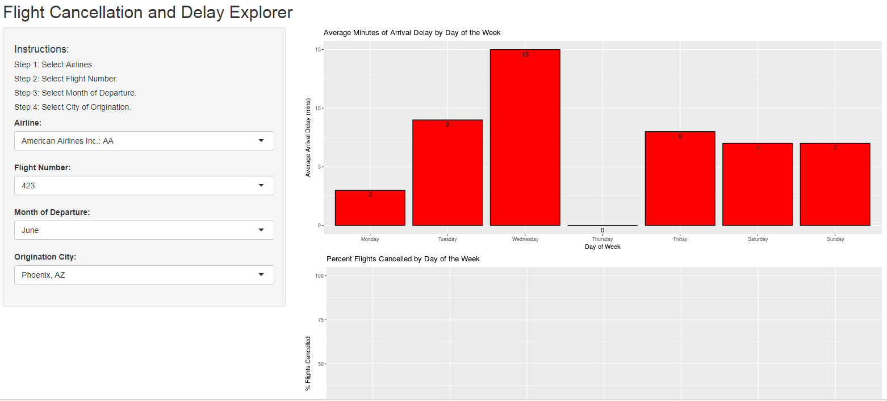

## Introduction

### Wouldn't Be Great If...

You knew whether your flight was going to be cancelled or delayed BEFORE you booked it?

Flight Explorer is a new application that allows you to see the past arrival delays and cancellations of your flight!

---

## Using Transit Bureau Data

Behind and intuitive user interface, Flight Explorer uses transportation bureau data from the prior 12 months to give you the information you need to have delay free travel.



---

## Summarized Flight Data
Individual Files from the Transportation Bureau were consolidated and summarized for use in the application.  See full code in the repository.  Links on last slide.

```{r echo=TRUE, eval=TRUE, cache=TRUE}
f.path <- file.path("..", "..", "developingdataproducts", "final_project", "FlightExplorer", "FlightSummaryData.csv" )
dfFlightSummary <- read.csv(f.path)
str(dfFlightSummary)

```

---

## May All Your Flights be Delay-Free

Shiny Application https://rougeone.shinyapps.io/FlightExplorer

Code Repo:  
https://github.com/wayneheller/developingdataproducts/tree/gh-pages/final_project/FlightExplorer

Pitch Deck https://wayneheller.github.io/FlightExplorerPitch

Flight Data Source https://www.transtats.bts.gov/Fields.asp

